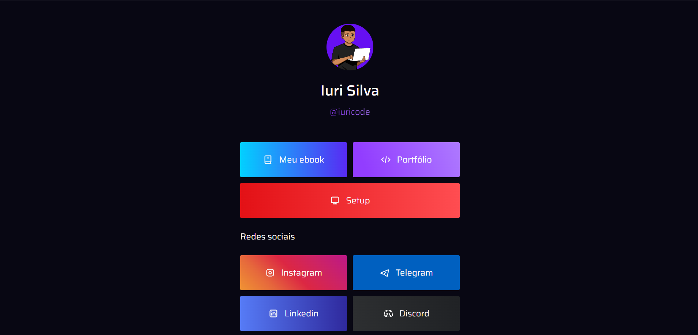

<h1 align="center">
  ☕ Bio - Sérgio Sobrinho
</h1>

<h4 align="center"><a href="https://www.iuricode.com/bio/">Clique para visitar o projeto</a></h4>

Inspirado na <a href="https://www.instagram.com/girl.coding/">girl.coding</a>

---

<h2>🦄 Autor</h2>

<table>
  <tr>
    <td align="center">
      <a href="https://github.com/sobrinhosergio">
         
        
          <b>Sérgio Sobrinho</b>
        
      </a>
    </td>
  </tr>
</table>
